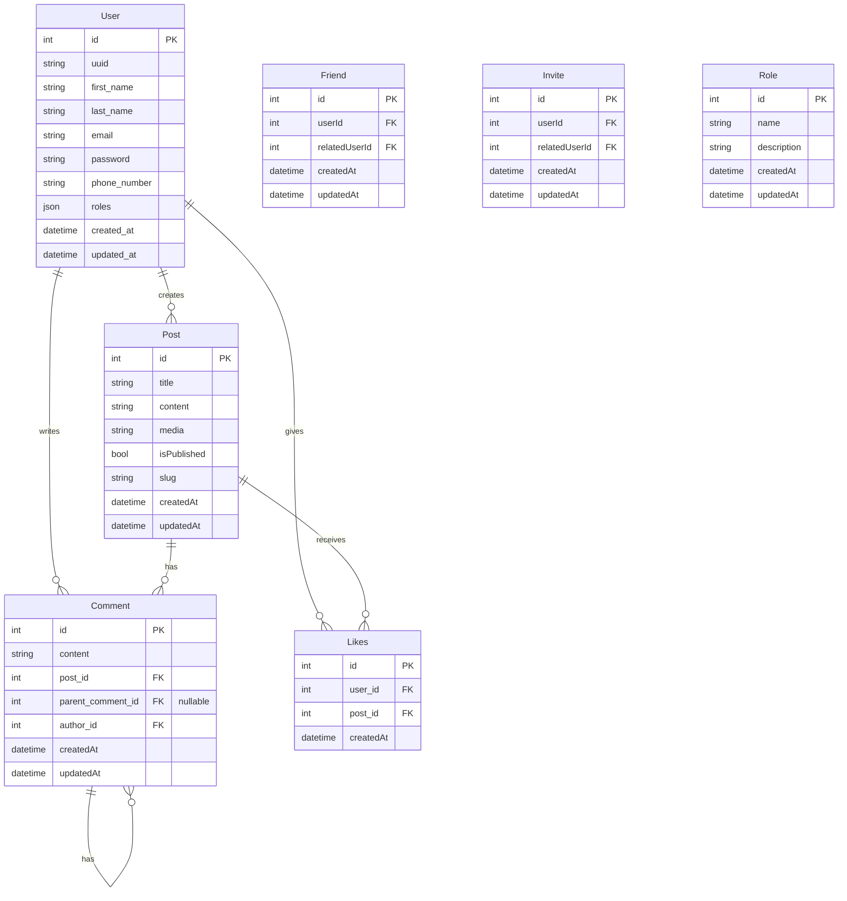

# FishingSpot

## Contents
- [App description](#app-description)
- [Let's start!](#lets-start)
- [Database](#doctrine-database)
- [Screenshots](#screenshots)


## App description
FishingSpot is an application that allows you to connect with your fishing friends!

## Let's start!

### 1. Clone Repository
To clone repository you can use the command below:
```shell
git clone https://github.com/Jarsey45/TeamProject.git
```

### 2. Run Docker Image
You need to have [Docker](https://www.docker.com/) installed on your environment  
Move to the project's directory and run the command below:

```shell
docker-compose up --build
```
### 3. Doctrine database

If you don't have database yet use:
```shell
php bin/console doctrine:database:create
```
Migration:
```shell
php bin/console doctrine:migrations:migrate
```


## Screenshots

### Login Page
| Desktop       | Mobile     |
|:-------------:|:------------:|
| | 

### Register Page
| Desktop       | Mobile     |
|:-------------:|:------------:|
| | 

<details>
  <summary>Dashboard</summary>

  | Desktop       | Mobile     |
  |:-------------:|:------------:|
  | | 

</details>

<details>
  <summary>Profile</summary>

  | Desktop       | Mobile     |
  |:-------------:|:------------:|
  | | 

</details>

## ERD Diagram


