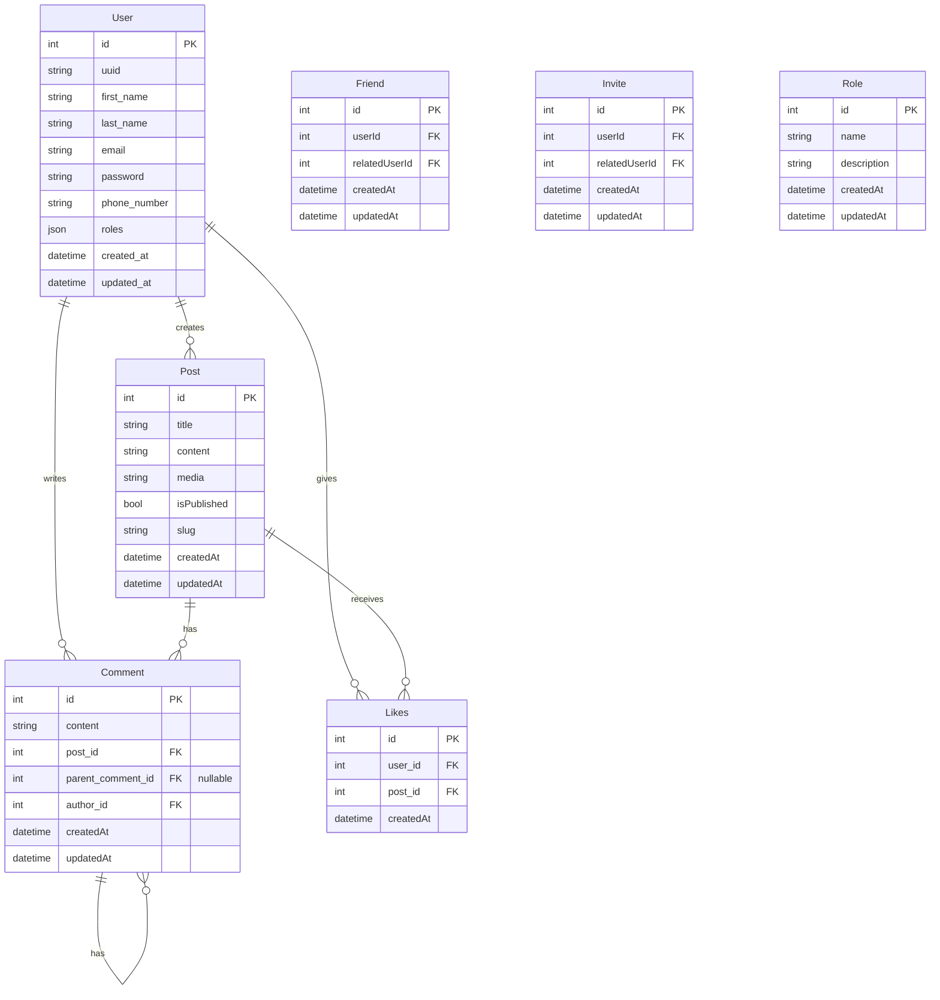

# FishingSpot

## Contents
- [App description](#app-description)
- [Let's start!](#lets-start)
- [Screenshots](#screenshots)
- [ERD Diagram](#erd-diagram)


## App description
FishingSpot is an application that allows you to connect with your fishing friends!

## Let's start!

### 1. Clone Repository
To clone repository you can use the command below:
```shell
git clone https://github.com/Jarsey45/TeamProject.git
```

### 2. Run Docker Image
You need to have [Docker](https://www.docker.com/) installed on your environment  
Move to the project's directory and run the command below:

```shell
docker-compose up --build
```


### 3. Symfony
To install Symfony inside Docker, run:

```shell
docker exec -it php_project-php-1 composer require symfony/runtime
```

### 4. Database

You can create database using:
```shell
docker exec -it php_project-php-1 php bin/console doctrine:database:create
```

Migration:
```shell
docker exec -it php_project-php-1 php bin/console doctrine:migrations:migrate
```

You can delete database using:
```shell
docker exec -it php_project-php-1 php bin/console doctrine:database:drop --force
```


## Screenshots

### Dashboard


### Login Page


### Registration Page
 


### Profile
 


## ERD Diagram


